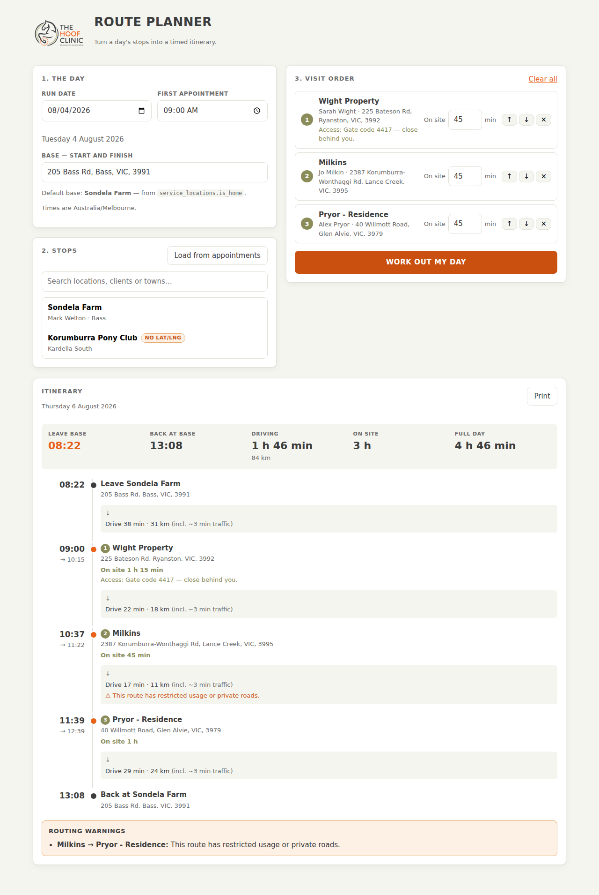

# THC Route Planner

Turns a day's list of stops into a timed itinerary for The Hoof Clinic: what time
to leave home, when you arrive at and leave each property, and what time you're
back — with per-leg drive time, distance, and any routing warnings Google
returns.

React + Vite front end, Vercel serverless functions for everything that touches a
key.



## How the schedule is worked out

The day is anchored on the **first appointment time**, not a leave time:

```
leaveBase      = firstAppointment − drive(base → stop 1)
arrival[0]     = firstAppointment
departure[i]   = arrival[i] + timeOnSite[i]
arrival[i]     = max(departure[i−1] + drive(i−1 → i), booked time of stop i)
returnToBase   = departure[last] + drive(last stop → base)
```

Where a stop carries the time the client was booked for — **Load from
appointments** fills these in, and you can type or clear one per stop — the
itinerary will not show you arriving before it. It shows the wait instead. If
the run cannot get there in time it says so, in red, at the top and against the
stop, rather than quietly printing an arrival the client was never told.

Each leg is priced with the `departureTime` it is actually driven at, so the
traffic estimate for the 07:00 run out is not the estimate for the 16:00 run
home. Because the leave time depends on the first leg's duration and that
duration depends on the leave time, the first leg is computed twice: once
departing at the appointment time for a rough figure, then again at the implied
leave time. That's the number you act on, so it's worth the extra call.

Planning a run in the past (or within the next minute) silently falls back to
traffic-unaware routing, which the itinerary labels.

Legs are cached for ten minutes, keyed on the two places and a 15-minute
departure bucket, so pressing the button again after adjusting a stop's time on
site does not pay for the whole run of calls a second time. On a three-stop
day, four plans cost 8 Routes API calls rather than 21, and re-planning an
unchanged day costs none. The cache lives in memory in the serverless function,
so a cold start pays full price.

## Setup

```bash
npm install
cp .env.example .env.local   # fill in the two keys
npm run dev                  # http://localhost:5173
npm test                     # scheduling + timezone tests
```

`npm run dev` runs the `api/` functions inside the Vite dev server (see the
`vercelApiDev` plugin in `vite.config.js`), so the local app behaves like the
deployed one without needing the Vercel CLI. That plugin also loads
`.env.local` into `process.env` for those handlers — Vite on its own exposes
only `VITE_`-prefixed variables, and only on `import.meta.env`, so the
server-side keys would otherwise be invisible in dev. A variable already set in
your shell wins over the file.

### Environment variables

`.env.local` is for local development only — it is gitignored and never
deployed. **On Vercel, set the same variables in the project settings instead.**

All of them are server-side; see `.env.example`. None is `VITE_`-prefixed, so
none reaches the browser bundle.

| Variable | Required | Purpose |
| --- | --- | --- |
| `SUPABASE_URL` | yes | Project URL |
| `SUPABASE_SERVICE_ROLE_KEY` | yes | Server-side reads of `service_locations` / `appointments` |
| `SUPABASE_ANON_KEY` | yes | Verifying access tokens, and served to the browser for sign-in |
| `GOOGLE_MAPS_API_KEY` | yes | Routes API (legs) and Maps Static API (map preview) |
| `BASE_ADDRESS` / `BASE_ADDRESS_LABEL` | no | Fallback base if no `is_home` location exists |
| `PLANNER_TIMEZONE` | no | Defaults to `Australia/Melbourne` |

#### Restricting the Google Maps key

Enable **Routes API** and **Maps Static API** on the key, then set its
restrictions in the Cloud Console as:

- **Application restrictions: None**
- **API restrictions: Restrict key** → Routes API, Maps Static API

This is the one bit of key setup that is easy to get wrong. Every Maps call in
this app is made from a Vercel function, never from the browser, and a
server-side request sends no `Referer` header — so an **HTTP referrer**
restriction rejects all of them:

```
Routes API failed for <origin> → <destination>:
Requests from referer <empty> are blocked.
```

An IP restriction is no better: Vercel's serverless egress addresses are not
fixed. That leaves the API restriction as the meaningful one, which is fine
here — the key exists only in the server environment and is never exposed to a
client. If you also keep a referrer-restricted key for browser use elsewhere,
make this a separate key rather than loosening that one.

### Deploying

Vercel auto-detects the Vite build and serves `api/*.js` as Node functions — no
`vercel.json` needed. Set the environment variables in the project settings and
push.

Note that Vercel scopes environment variables per environment — Production,
Preview and Development each hold their own values. A key set for Production
does not apply to a PR preview deployment, and changing a value requires a
redeploy before it takes effect. If a key looks correct in the Console but the
app still rejects it, the deployment you are testing is usually reading a
different one.

## Signing in

The planner is behind the same Supabase account as the main hoof-tracker app.
Every `api/*` endpoint verifies the access token the browser sends, and the
verified user id — not an environment variable — is what scopes the query to
your rows.

The one exception is `GET /api/config`, which is deliberately public: it hands
the browser the project URL and anon key so it can run the sign-in flow at all.
That is the standard publishable pair, and RLS is what protects the data.
It is served from an endpoint rather than a `VITE_SUPABASE_ANON_KEY` build
variable so that every value in this project is set in one place — see the note
above about Vercel scoping variables per environment.

## Decisions worth knowing about

**Base address — it already exists in the schema.** `profiles` has no address
column, but `service_locations` has an `is_home` flag, and the row carrying it is
Sondela Farm (205 Bass Rd, Bass VIC 3991) with coordinates already on it. That is
the default base. It is not hardcoded: the UI lets you type a different one,
which is stored as a local override in `localStorage`, and "reset to default"
clears the override so a change to `is_home` in Supabase takes effect again.

**Data access — direct, not via `db-proxy`.** Both were on the table. Direct
querying with the service-role key inside the Vercel function won: a real query
builder rather than hand-assembled PostgREST strings, one fewer hop, and no
dependency on an endpoint this app doesn't own. See the security note below for
the other reason.

**Coordinates over geocoding.** All 17 active `service_locations` rows have
`latitude`/`longitude`, so legs are computed from stored coordinates. Rows
without them fall back to the composed address string, which the Routes API
geocodes itself; the picker tags those rows `no lat/lng` and the itinerary lists
which stops were geocoded.

**Routes API over the legacy Directions API.** It is the current product, takes a
future `departureTime` for predictive traffic, and returns per-route `warnings`
— including the "restricted usage or private roads" advisories, which are shown
against the leg that produced them and collected at the foot of the itinerary.

**Schema note.** The brief described the columns as `address`, `lat`, `lng`. They
are actually `address_line1` / `address_line2` / `town_city` / `county` /
`postcode`, and `latitude` / `longitude`. Also, `service_locations` has *two*
foreign keys to `clients` (`client_id` and `created_by_client_id`), so the client
name embed has to name the constraint explicitly or PostgREST rejects it as
ambiguous.

## Layout

```
api/            Vercel serverless functions — the only code that sees a key
  locations.js    GET  service locations + the default base
  appointments.js GET  a date's appointments, grouped by location
  plan.js         POST the itinerary
  staticmap.js    POST route map image bytes (keeps the key off the client)
lib/            Server-side modules
  schedule.js     Itinerary construction — no I/O, fully unit-tested
  google.js       Routes API client
  time.js         Australia/Melbourne wall-clock ↔ instant conversion
  supabase.js     Service-role client
src/            React app
test/            node:test suites for the scheduling and timezone logic
```

`lib/schedule.js` takes the leg fetcher as an argument, so the scheduling rules
are tested against stubbed legs with no network involved.

## What's next

[`docs/ROADMAP.md`](docs/ROADMAP.md) is the prioritised enhancement plan —
what to build next, in what order, and why. The two items at the top are
authenticating the API (it is currently open) and honouring each stop's booked
appointment time rather than only the first one's.

## Picking the order

With three or more stops and none of them booked for a time, **Try a better
order** compares the list against the best order Google can find and reports
what the difference is worth — *"saves 12 km and 18 min of driving"* — with the
suggested order written out. Nothing moves until you press **Use this order**,
and that only reorders the list; the run is still timed by **Work out my day**.

It is unavailable once a stop carries a booked time, because reordering those
would break times clients have already been given. The useful moment for it is
before the day is booked, when you are deciding what order to offer.

The comparison is two traffic-unaware calls, so both orders are measured under
the same conditions. It is never used to time the run: a multi-waypoint route
assumes you drive straight through and knows nothing about the time spent at
each property.

## Driving the run

Each stop on the itinerary carries **Navigate** (Google Maps) and **Apple Maps**
links, and the itinerary header has **Open the day in Google Maps** — base, every
stop in order, back to base. Google's URL API takes nine waypoints, so a longer
run says which stops did not fit rather than silently dropping them. All of it
is hidden in print.

## What the run cost

Under the itinerary, **Fuel for this run** turns the computed distance into a
dollar figure, and **Log this run** records it in `fuel_cost_calculations` —
the table these numbers were being typed into by hand. Litres per 100 km and
the fuel price are prefilled from the last run logged and stay editable.

The description is composed the way the existing rows read
(`Eichhorn - Wonga (Lyric, Charlie); Best Family Farm (…)`), and the run's
appointment ids are attached. Both are rebuilt server-side from the stop ids,
so a logged run always describes rows that exist.

This is the **only** thing in the app that writes to the practice database.

## Not built (from the brief's nice-to-haves)

- **Saving a planned route back to Supabase.** Needs a new table in the
  production database; worth agreeing on the shape first.
The map preview and a print view *are* included. Off-by-default stop reordering
was the other item here; it is built now — see "Picking the order" above.

## Security note

One thing left, and it is not in this repository:

**`db-proxy` is an unauthenticated service-role SQL endpoint.** It is deployed
with `verify_jwt: false` and `Access-Control-Allow-Origin: *`, and it forwards
an arbitrary `sql` parameter to an `execute_sql` RPC using the service-role
key. Anyone who knows the URL can read or write any table, bypassing RLS.
Worth putting behind a shared secret or JWT verification, or removing if
nothing depends on it. Still deployed as of August 2026.

**`fuel_cost_calculations` is still open to the anon key.** An earlier note here
said enabling RLS had resolved this. RLS *is* enabled now, but the four
policies on the table grant `anon` and `authenticated` SELECT, INSERT, UPDATE
and DELETE with `USING (true)` — so anyone holding the anon key can still read,
change or delete every row. That is barely different from RLS being off. It
needs real policies, and tightening them may affect the main hoof-tracker app,
which is why it is flagged rather than changed here. The planner writes to this
table through the service-role key and is unaffected either way.

One item that used to be listed here *is* resolved: this app's own `api/*`
endpoints now require a verified Supabase session.
